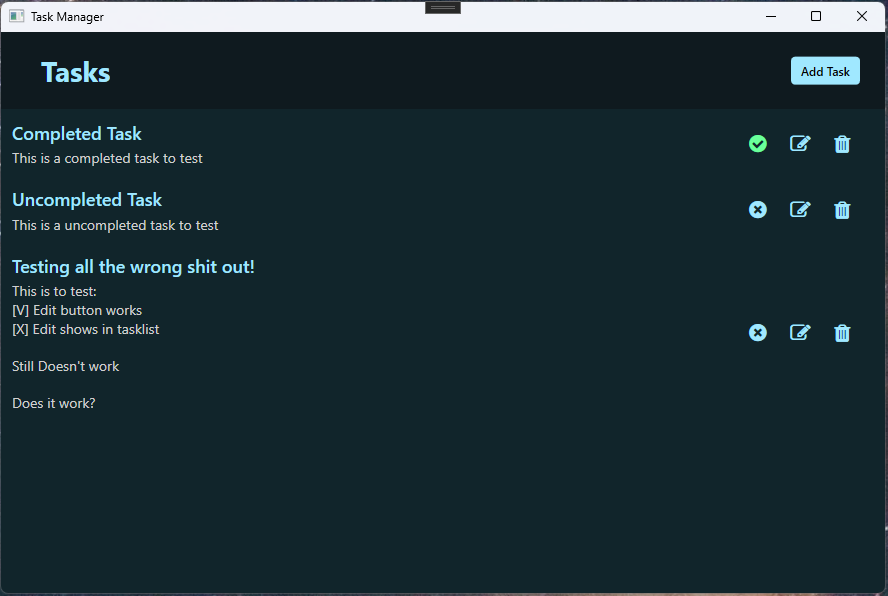
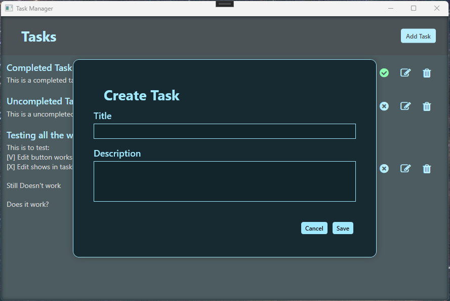
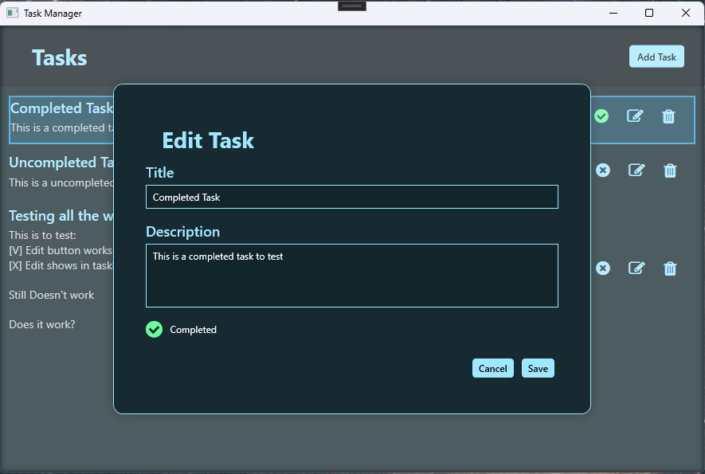

# 📝 WpfManager - TaskManager  
A modern, modular WPF application built with a strong focus on **MVVM**, **clean architecture**, **reusable UI components**, and a **sleek dark theme**.

TaskManager provides an elegant way to manage tasks — including creating, editing, completing, and deleting — all within a consistent, modern, and extensible UI.

---

## 🚀 Features

### 🎨 Modern WPF UI
- Dark theme with accent colors  
- FontAwesome icons  
- Smooth hover animations  
- Centralized styling via resource dictionaries  
- Popup overlay system with clean transitions (extensible)

### 🧠 MVVM Architecture
- Fully separated Views, ViewModels, and Models  
- Zero code‑behind  
- Command‑driven interactions  
- Repository layer for data persistence  
- Modular popup system for dialogs and forms  

### ✔ Task Functionality
- Add new tasks  
- Edit existing tasks  
- Delete tasks  
- Toggle completion state  
- Dynamic icons and colors based on task state  
- Edit popup with live preview of changes  

### 🪟 Popup Architecture
Reusable overlay popups for:
- Creating tasks  
- Editing tasks  
- (Coming soon) confirmation dialogs  
- (Extensible) custom dialogs with icons, titles, and multiple button layouts  

---

## 🖼 Screenshots

<p align="center"> 
   
   
   
</p>

---

## 🧱 Project Structure
```
TaskManager/
│
├── Models/                      # Data objects (TaskItem, etc.)
│
├── ViewModels/                  # All ViewModels
│   ├── TaskItem/                # TaskItemViewModel, TaskItemEditViewModel, TaskItemCreateViewModel
│   ├── Popups/                  # Popup ViewModels (ConfirmDeleteViewModel, etc.)
│   └── MainViewModel.cs         # Main application ViewModel
│
├── Views/                       # All XAML Views
│   ├── TaskItem/                # TaskItemView, TaskItemEditView, TaskItemCreateView
│   ├── Popups/                  # ConfirmDeleteView, etc.
│   └── MainView.xaml            # Main window
│
├── Services/                    # Repository
│   ├── ITaskRepository.cs
│   ├── JsonTaskRepository.cs
│
├── Resources/                   # Brushes, Colors, Styles, Templates
│   ├── Brushes.xaml
│   ├── Colors.xaml
│   ├── Styles.xaml
│
└── App.xaml                     # Application entry point
```

---

## 🛠 Technologies Used

- **WPF (.NET)**  
- **MVVM**  
- **FontAwesome WPF**  
- **ObservableCollection**  
- **RelayCommand**  
- **Custom Styles & Control Templates**

---

## 📦 Installation

1. Clone the repository  
   ```bash
   git clone https://github.com/J0rnJ/WpfManager
   ```

2. Open the solution in Visual Studio
3. Build & run

---

## 🧩 Possible Roadmap / Possible Future Enhancements

- Fully modular DialogService
- Custom confirmation dialogs (1–3 buttons, icons, titles)
- Popup animations (fade/scale)
- Settings screen
- Theme switching
- Notification system
- Multi‑project architecture (Core / UI / Services)

---

## 📄 License
This project is licensed under the MIT License.
See the LICENSE file for more information.
